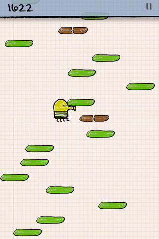

# Doodle Jump

## Description
Doodle Jump est un jeu de type plate-forme développé et publié par [Lima Sky ](http://www.limasky.com/), qui ont developper d'autres jeux mais qui n'ont pas rencontrer un grand succès, et partager sur différent supports tel que iOS, windows phone, Android, Java Mobile, etc... Ce jeu est disponible en anglais et en français. Doodle Jump tire en réalité son inspiration d'un jeu japonais nommer [Papijump](https://www.youtube.com/watch?v=Fx_vVv6J8gM&ab_channel=Tech%26NostalgiaKingdom) de Sunflat Games

### Date de publication
- iOS : 6 avril 2009 ;
- Android : 2 mars 2010 ;
- Symbian : 1er mai 2010;
- Windows Phone : 1er juin 2011 ;
- Xbox 360 : 28 juin 2013 ;
- Nintendo DS : 23 octobre 2013 ;

## Règles du jeu

Les règles de ce jeu sont assez simple. Le but est de faire monter le petit bonhomme vert (appeler le Doodler) le plus haut possible, tout en utilisant les plateformes qui lui sont mis à disposition.Le côté droit et gauche de l'écran communique. Pour ce qui est des plateformes, il en existe de 3 types: les verts qui sont les plateformes de "base", les bleues qui bouge de gauhe à droite de l'écran et les brunes qui se brisent lorsque le joueur tente de les utiliser.  Le score augmente en même temps que la hauteur que gravit le Doodler. Si l'utilisateur vient à tomber dans le vide, le score s'arrête et la partie est terminée. Il existe plusieurs "bonus" pour aider le petit bonhomme vert à monter le plus haut possible tels que :  
- Ressort : qui permet de sauter 2x plus haut que la normale;
- Trampoline : qui permet de sauter 3x plus haut que la normale et fait faire au personnage un tour sur lui-même;
- Chapeaux : Fait s'envoler le personnages durant 3 secondes et lui fait donc gagner beaucoup de hauteur;
- Jetpack : Fait s'envoler le personnages durant 4 secondes et est plus rapide que le chapeaux;

## Liste règles reprises

- Bonhomme qui se déplace en hauteur (en sautant).
- Plateforme apparraissent de façon aléatoire
- Score augmente en fonction de la hauteur
- Si le joueur tombe la partie prend fin
- N'utilier que le ressort pour prendre hauteur supplémentaire
- Déplacement gauche-droite avec passage hors écran
- Présence des différente plateformes et leur "spécificité" ?
 

## Liste de chose à faire

- [ ] Modifier index pour ajouter section de début de partie et fin de partie (_class hidden_);
- [ ] Ajouter css pour les textes, les boutons;
- [ ] Dessiner différentes plateformes de façon aléatoire;
- [ ] Dessiner le Doodler et ses différent changements (sprite);
- [ ] Faire bouger le Doodler avec des sauts puis bouger en suivant flèche du clavier;
- [ ] Détecter collision entre Doodler et les plateformes;
- [ ] Dessiner de façon aléatoire les ressorts;
- [ ] Faire rebondir plus haut le Doodler lors de la collision avec ressort;
- [ ] Faire varier le score;
- [ ] Lorsque le Doodler tomber dire au joueur qu'il a perdu + ajout section "Recommencer";

(Voir démonstration du jeu [ici](https://www.youtube.com/watch?v=wjofzwaC_Oo&t=958s&ab_channel=grivrus347))

 _Certaines images présentent dans ce travail proviennent de ce [site](https://imgur.com/)
Pour le [fond](https://i.imgur.com/Y0BMP.png);
Pour le [bonhomme](https://i.imgur.com/2WEhF.png)_

